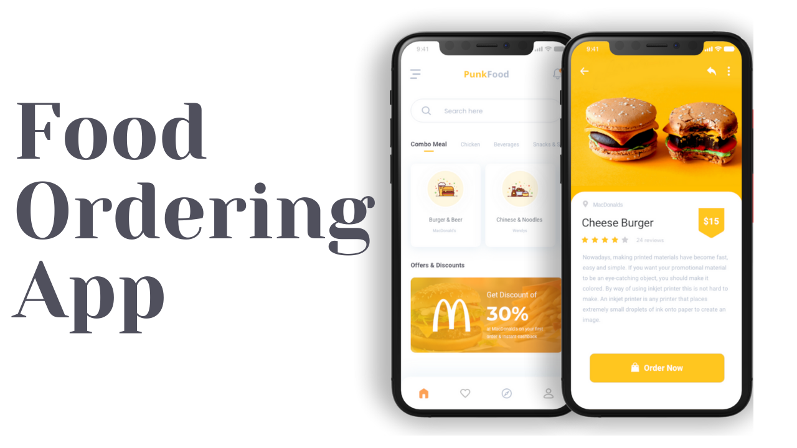
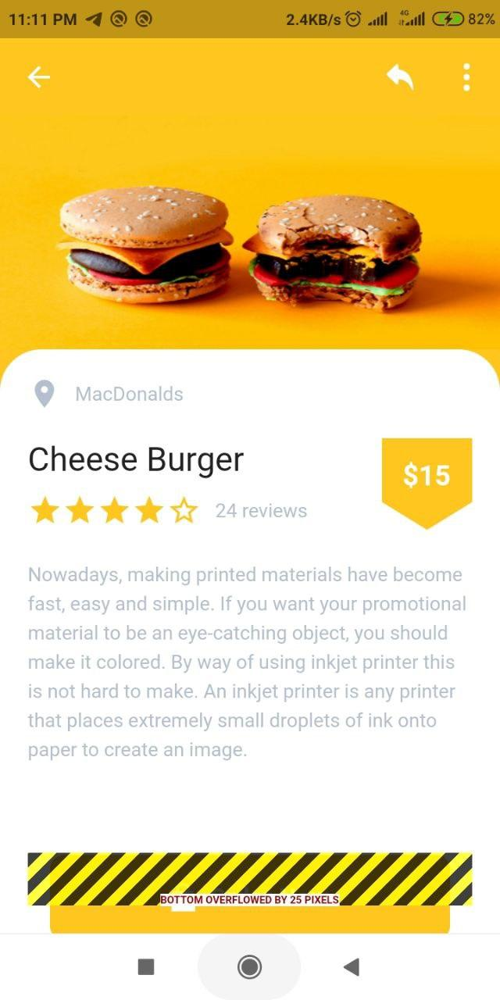

# Food App UI - Flutter Food Ordering Application

> We design two pages one is the home page and another one is details page that will help you to design clear interfaces for food delivery app faster and easier.



## Demo Screenshots

| Home | Home | Food |
| :---: | :---: | :---: |
|  |  |  | 

## Try & Demo

Run:

```bash
$ git clone https://github.com/BaseMax/Flutter-Food-Ordering-App
$ cd Flutter-Food-Ordering-App
$ flutter run
```

Check tools:

```bash
$ flutter doctor -v
$ flutter devices
$ flutter pub get
$ flutter packages get
```

Build:

```bash
$ flutter build apk
```

## Sources

What sources I did get help from:

- http://www.androidcoding.in/2020/09/12/flutter-google-fonts/
- https://pub.dev/packages/google_fonts/example
- https://stackoverflow.com/questions/59446354/the-google-fonts-package-in-flutter-app-is-not-working
- https://api.flutter.dev/flutter/material/InkWell-class.html
- https://pub.dev/packages/google_fonts
- https://www.geeksforgeeks.org/flutter-using-google-fonts/
- https://pub.dev/documentation/google_fonts/latest/google_fonts/GoogleFonts-class.html

### Acknowledgment

I saw an [Youtube video](https://www.youtube.com/watch?v=F0ujC60wHwc) and It's encouraged me to repeat this project myself.

**P.S:** All of images not designed or prepared by me. They are for Abu Anwar. Thanks.

© Copyright Max Base
